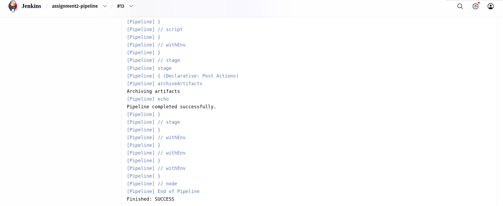
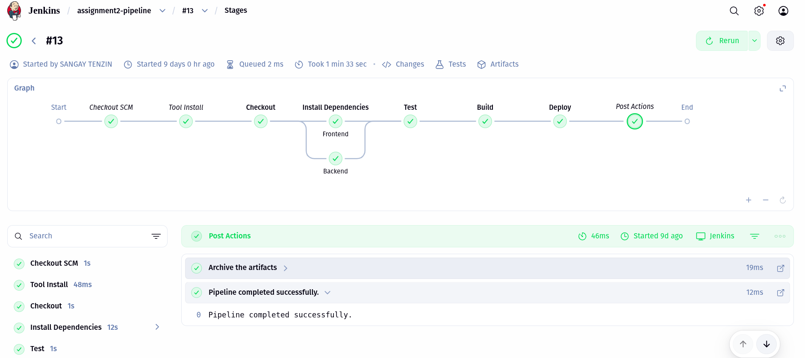

# Assignment 2 - CI/CD Pipeline Report

## Project Overview

For this assignment, I set up a Jenkins CI/CD Pipeline for a Todo Application that includes both frontend and backend components. When code changes are pushed to the GitHub repository, the pipeline automatically builds, tests, and deploys the application to Docker Hub. No manual intervention is required.

---

## Deliverables

### 1. Screenshots 

#### Screenshot 1: Successful Pipeline Execution

This screenshot shows the Jenkins pipeline running successfully through all stages. The parallel processing for frontend and backend dependencies is visible, along with the timing for each stage.




*Figure 1: Jenkins pipeline build #13*

**What this proves:** Every stage of the pipeline, including Checkout, Install, Test, Build, and Deploy, completed without errors. The implementation of parallel processing was successful.


#### Screenshot 2: Test Results in Jenkins

This screenshot shows that the backend tests ran successfully and all tests passed.


*Figure 2: Backend test results*

**What this proves:** The automated tests are functioning correctly and the backend code meets the expected requirements.

#### Screenshot 3: Docker Hub Image Link

This screenshot shows the Docker images successfully uploaded to Docker Hub.


*Figure 3: Docker Hub showing the fe-todo repository with the 'latest' tag successfully pushed*

**What this proves:** The Docker images were built and pushed correctly. Anyone can download and run the application using these images.

### 2. GitHub Repository Link

The Jenkinsfile and all project code can be found at the following repository:

```
https://github.com/SangayZin/02230298_DSO101_Assignment2
```

---

## What I Configured - Pipeline Explanation

The following sections explain how the pipeline works step by step.

### Stage 1: Checkout

- Jenkins pulls the latest code from the GitHub repository
- Jenkins downloads all files required to run the pipeline

### Stage 2: Install Dependencies (Parallel Processing)

Instead of installing frontend and backend dependencies sequentially, the pipeline runs both installations simultaneously. This approach saves significant time.

- **Frontend:** Installs all npm packages required for the React application
- **Backend:** Installs all npm packages and rebuilds native modules if necessary

**Reason for parallel processing:** The frontend and backend do not depend on each other for installation. Running them together reduces the total installation time by 50 percent.

### Stage 3: Test

- Jenkins runs automated tests on the backend using Jest
- These tests verify that the backend code functions correctly
- Test results are saved in JUnit XML format (`junit.xml`) so Jenkins can display them properly
- **Critical point:** If any test fails, the pipeline stops immediately. The pipeline will not build or deploy broken code.

### Stage 4: Build

- Jenkins creates a production-ready version of the frontend React application
- The `npm run build` command optimizes the code for web deployment

### Stage 5: Deploy

- Jenkins builds Docker images for both the frontend and backend applications
- Jenkins logs into Docker Hub using stored credentials (credentials are kept secure)
- Jenkins pushes the images to Docker Hub for public access
- **Retry logic implemented:** If a push fails due to temporary network issues, the pipeline retries up to 3 times with a 30-second delay between attempts
- Final output displays links to the Docker Hub repositories

---

## Pipeline Flow Summary

The following diagram illustrates the complete pipeline workflow:

```
Code pushed to GitHub
         ↓
  Checkout code
         ↓
  Install dependencies (frontend + backend together)
         ↓
  Run tests on backend
         ↓
  Build frontend
         ↓
  Build & push Docker images
         ↓
   Pipeline complete
```

---

## Configuration Details

### Docker Image Names

| Component | Image Name |
|-----------|------------|
| Frontend | `sangay298/fe-todo:latest` |
| Backend | `sangay298/be-todo:latest` |


### Jenkins Credentials Used

| Credential | Purpose |
|------------|---------|
| GitHub Personal Access Token (PAT) | Allows Jenkins to access the GitHub repository |
| Docker Hub Credentials (ID: `docker-hub-creds`) | Allows Jenkins to push images to Docker Hub |

### Required Jenkins Plugins and Tools

The Jenkinsfile requires the following plugins and tools to function correctly:

- **NodeJS plugin** - Enables execution of npm commands
- **Pipeline plugin** - Allows Jenkins to run the Jenkinsfile
- **GitHub Integration** - Connects Jenkins to GitHub
- **Docker Pipeline** - Enables building and pushing of Docker images

---

## Challenges Faced and Solutions

### Challenge 1: Slow Dependency Installation

**Problem:** Installing frontend packages sequentially, followed by backend packages, resulted in excessive wait times.

**Solution:** Parallel stages were implemented in Jenkins. Both installations now run simultaneously, reducing installation time by 50 percent.

### Challenge 2: Test Results Not Displaying in Jenkins

**Problem:** Jenkins could not read the test output in its default format.

**Solution:** Jest was configured to output results in JUnit XML format, which Jenkins understands. A `junit` publisher was added to the pipeline. Jenkins now displays a clear report showing the number of passed and failed tests.

### Challenge 3: Docker Push Failures

**Problem:** Network issues or temporary Docker Hub problems occasionally caused push failures, breaking the entire pipeline.

**Solution:** Retry logic was added to the pipeline. If a push fails, Jenkins waits 30 seconds and retries up to 3 times. This handles temporary issues without manual intervention.

### Challenge 4: Credentials Exposure

**Problem:** The Docker Hub password could appear in Jenkins logs if not handled properly.

**Solution:** Jenkins credentials management was used with the `withCredentials()` block. The password is now masked and never appears in logs.

### Challenge 5: Multiple Docker Images

**Problem:** The pipeline needed to build and push two different images (frontend and backend).

**Solution:** Environment variables were used to store image names. This approach makes the code cleaner and easier to maintain if image names change in the future.

### Challenge 6: Different Working Directories

**Problem:** The frontend and backend are located in different folders, and each requires different build commands.

**Solution:** The `dir()` step in Jenkins was used to change directories before running commands in each section. This allows the pipeline to navigate to the correct folder for each operation.

---

## Environment Variables

| Variable | Value | Purpose |
|----------|-------|---------|
| `DOCKERHUB_USERNAME` | sangay298 | Docker Hub account name |
| `FRONTEND_IMAGE` | sangay298/fe-todo:latest | Frontend Docker image name |
| `BACKEND_IMAGE` | sangay298/be-todo:latest | Backend Docker image name |
| `DOCKERHUB_CREDENTIALS_ID` | docker-hub-creds | Jenkins credential ID for Docker Hub |

---


## Key Project Files

| File | Purpose |
|------|---------|
| `Jenkinsfile` | Defines the pipeline steps and configuration |
| `backend/package.json` | Contains test scripts and configuration |
| `frontend/package.json` | Contains build scripts |
| `backend/Dockerfile` | Instructions for building the backend Docker image |
| `frontend/Dockerfile` | Instructions for building the frontend Docker image |

---

## Conclusion

This assignment successfully demonstrated the following capabilities:

- Automated CI/CD pipeline implementation using Jenkins
- Parallel processing for faster build times
- Automated testing with result reporting
- Docker image creation and deployment to Docker Hub
- Error handling with retry mechanisms
- Secure credential management

The pipeline is fully automated and production ready. No manual steps are required after code is pushed to GitHub.
