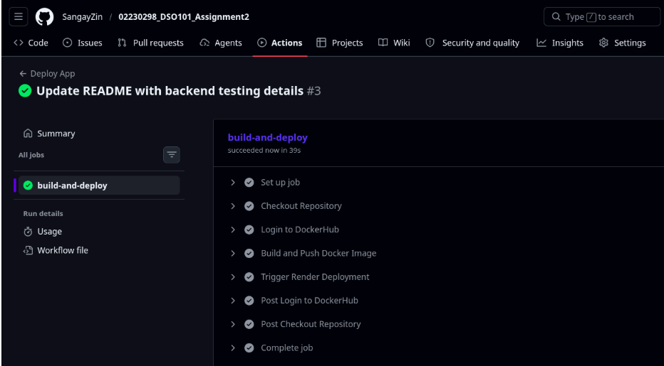
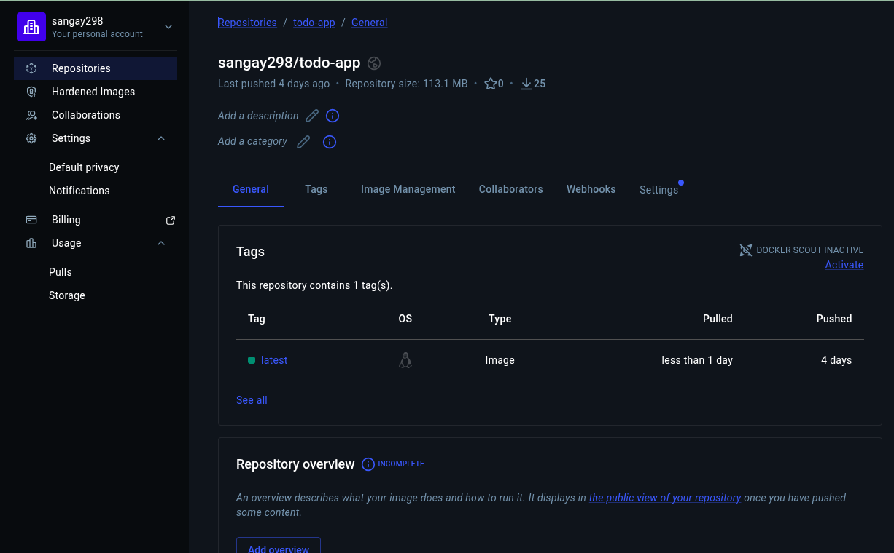
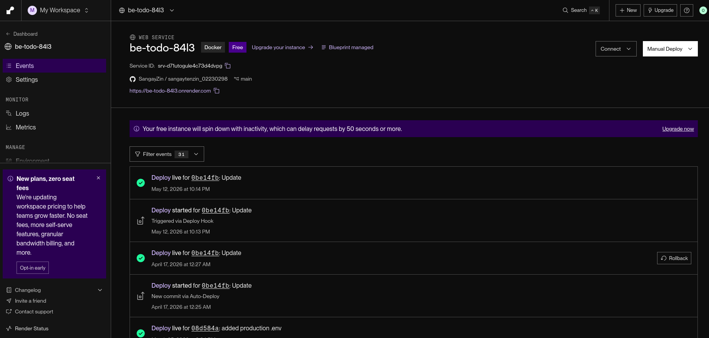

# Assignment 3 Report – CI/CD Pipeline with Docker, GitHub Actions & Render

## Introduction

In this assignment, I set up an automated CI/CD pipeline for a Node.js to-do application. The goal was to automatically build a Docker image, push it to DockerHub, and deploy it to Render.com whenever I push changes to the main branch. This removes the need for manual deployment and makes the whole process faster and more reliable.

## Tools I Used

| Tool | What I used it for |
|------|-------------------|
| GitHub | Storing my code |
| GitHub Actions | Running the automation |
| Docker | Packaging my app into a container |
| DockerHub | Storing the Docker image online |
| Render.com | Hosting the live application |
| Node.js | Running the backend of my app |

## What I Did

### Task 1: Setting Up the GitHub Repository

I made sure my repository was public and that the `package.json` file contained the necessary scripts for starting and testing the application. This was important because the workflow depends on those scripts.

### Task 2: Creating and Testing the Dockerfile

I created a `Dockerfile` that follows the expected structure:

- Used `node:20-alpine` as the base image
- Set the working directory inside the container
- Copied the package files and installed dependencies
- Copied the rest of the application code
- Exposed port 3000
- Set the command to start the app

After writing the Dockerfile, I tested it locally by building the image and running a container. Everything worked as expected.

### Task 3: Building the GitHub Actions Workflow

I created a workflow file inside `.github/workflows/deploy.yml`. This workflow runs every time I push code to the `main` branch. It does the following steps automatically:

1. Checks out the latest code
2. Logs into DockerHub using secret credentials
3. Builds the Docker image
4. Pushes the image to DockerHub
5. Triggers a redeployment on Render using a webhook

I also added three secrets in my GitHub repository settings:
- `DOCKERHUB_USERNAME`
- `DOCKERHUB_TOKEN`
- `RENDER_WEBHOOK`

This kept my credentials safe and out of the code.

### Task 4: Deploying on Render.com

I created a new web service on Render.com and chose the option to deploy from an existing Docker image. I connected it to the Docker image I pushed to DockerHub. Then I set up a webhook URL from Render and added it as a secret in GitHub. Now, whenever the GitHub Actions workflow runs, Render automatically pulls the latest image and redeploys the app.

## How the Whole Pipeline Works

Here's what happens from start to finish:

1. I make changes to my code and push to the `main` branch on GitHub.
2. GitHub Actions detects the push and starts the workflow.
3. The workflow builds a fresh Docker image of my app.
4. It pushes that image to my DockerHub repository.
5. It sends a `curl` request to Render's webhook URL.
6. Render pulls the new image and deploys the updated app.

No manual steps. No waiting around.

## Challenges I Ran Into

Even though everything worked in the end, I faced a few problems along the way:

- **Dockerfile adjustments:** I had to make sure the file paths and commands matched my project structure. At first, the build kept failing because of small mistakes like missing files or wrong folder names.

- **GitHub Secrets setup:** It took me a couple of tries to correctly generate a DockerHub token and add it as a secret in GitHub. I learned that you can't use your regular password — you need an access token.

- **Render webhook error:** This was the most confusing one. My workflow failed with `curl: (2) no URL specified` because the curl command in the workflow file was missing the actual webhook URL. I fixed it by properly referencing the `RENDER_WEBHOOK` secret inside the command.

- **Render not auto-deploying:** I discovered that Render does not automatically watch DockerHub for new images. That's why I needed the webhook in the first place. Without it, I would have to manually redeploy every time.

## What I Learned

This assignment taught me a lot of useful things:

- How to wrap a Node.js application inside a Docker container
- How to write a GitHub Actions workflow that runs automatically on every push
- How to store sensitive information like passwords and tokens using GitHub Secrets
- How to connect DockerHub with Render so that deployments happen automatically
- How to debug CI/CD failures by reading workflow logs carefully

I now feel much more confident setting up automated deployments for my future projects.

## Screenshots

Here are the screenshots that show my completed work:

### Screenshot 1: GitHub Actions Workflow – Successful Run

### Screenshot 2: DockerHub – Image Pushed Successfully

### Screenshot 3: Render.com – Live Deployment

### Screenshot 4: GitHub Secrets (No Hardcoded Credentials)

*This shows the three secrets configured in my repository: DOCKERHUB_USERNAME, DOCKERHUB_TOKEN, and RENDER_WEBHOOK.*

### Screenshot 5: Workflow File (deploy.yml)

*This shows my actual GitHub Actions workflow configuration. The workflow builds the Docker image from the backend folder and pushes it to DockerHub.*

## Conclusion

This assignment showed me how powerful CI/CD can be. By combining GitHub Actions, Docker, and Render, I was able to automate the entire process of building, storing, and deploying my application. Now, every time I push a change, my live app updates automatically. This is exactly how modern development teams work, and I'm glad I got to experience it first-hand.

---

